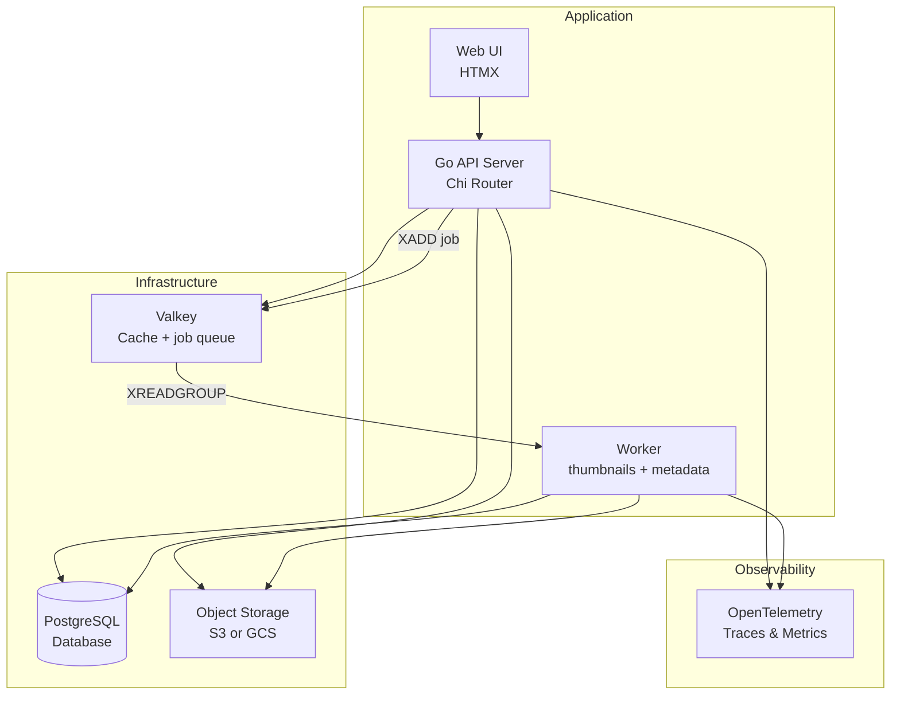

# Image Gallery

A Go image gallery application for demo purposes.

## 🏗️ Architecture



### Infrastructure Components

- **PostgreSQL Database**: Primary data store for image metadata, tags, albums and the async processing `status`
- **Object Storage (S3 or GCS)**: Selected by `STORAGE_PROVIDER`; S3 via `minio-go` (EKS Pod Identity in production), GCS via Application Default Credentials (GKE Workload Identity), behind one `ObjectStore` interface
- **Valkey**: Cache with graceful degradation, and the `image-gallery:jobs` stream that hands uploads to the worker
- **OpenTelemetry**: Distributed tracing, metrics, and structured logging with trace correlation, across the web and worker roles

## 🎭 Roles

`image-gallery` is one binary with three roles, selected by the first argument:

| Role | Command | Runs as | `service.name` |
|---|---|---|---|
| web | `image-gallery serve` (default) | HTTP UI + API | `xplane-image-gallery` |
| worker | `image-gallery worker` | queue consumer: thumbnails + metadata | `xplane-image-gallery-worker` |
| load generator | `image-gallery loadgen` | CLI or in-cluster Job/CronJob | `image-gallery-loadgen` |

Locally, run web and worker as two processes sharing the same Postgres, storage bucket and Valkey:

```bash
./bin/image-gallery serve    # terminal 1
./bin/image-gallery worker   # terminal 2 — needs CACHE_ENABLED=true and a reachable Valkey
```

Without Valkey, `serve` still accepts uploads, but no job can be queued, so each image is marked `failed` ("enqueue failed: no job queue configured") and shows its original instead of a thumbnail.

## ⚙️ Environment

The full reference lives in `.env.example`; these are the variables new or most relevant to v2:

| Variable | Default | Meaning |
|---|---|---|
| `STORAGE_PROVIDER` | `s3` | `s3` or `gcs` — selects the object-store backend |
| `STORAGE_BUCKET` | `images` | bucket/container name, both providers |
| `STORAGE_ENDPOINT` | `localhost:9000` | s3 only |
| `STORAGE_REGION` | `us-east-1` | s3 only |
| `STORAGE_USE_SSL` | `false` | s3 only |
| `CACHE_ADDRESS` | `localhost:6379` | Valkey address — also the `image-gallery:jobs` queue the worker reads |
| `WORKER_HEALTH_ADDR` | `:8081` | worker's liveness/readiness port |
| `WORKER_CONCURRENCY` | `2` | worker's concurrent job handlers |
| `DEMO_CONTROLS_ENABLED` | `true` | `false` removes the `/api/settings/demo` endpoints and injects no faults; a switch, not access control |
| `POD_NAME` | *(empty)* | `k8s.pod.name` resource attribute (Downward API in-cluster) |
| `POD_NAMESPACE` | *(empty)* | `k8s.namespace.name` resource attribute |
| `OTEL_SERVICE_NAME` | unset — per-role default: `xplane-image-gallery` (serve), `xplane-image-gallery-worker` (worker), `image-gallery-loadgen` (loadgen) | setting it explicitly gives every role the same `service.name`, defeating the per-role default |
| `OTEL_SERVICE_VERSION` | unset — the version built into the binary (`dev` for local builds) | setting it overrides the built version |
| `OTEL_DEPLOYMENT_ENVIRONMENT` | value of `GO_ENV` | |
| `OTEL_TRACES_ENABLED` | `true` | |
| `OTEL_TRACES_SAMPLER` | `always_on` | |
| `OTEL_TRACES_SAMPLER_ARG` | `1.0` | |
| `OTEL_EXPORTER_OTLP_TRACES_ENDPOINT` | `localhost:4318` | |
| `OTEL_METRICS_ENABLED` | `true` | |
| `OTEL_EXPORTER_OTLP_METRICS_ENDPOINT` | `localhost:4318` | |

A few more you may want to tune: `STORAGE_SYNC_ON_STARTUP` (sync existing bucket objects into the
database on boot, default `false`), `MAX_UPLOAD_SIZE` (default `10MB`) and `ALLOWED_FILE_TYPES`
(default `image/jpeg,image/png,image/gif,image/webp`).

## 🎚️ Demo controls

Fault injection for demos, stored in `demo_controls` and cached for 5 s. Every control is off by
default (`Controls{}` zero value):

```bash
curl -X PUT http://localhost:8080/api/settings/demo \
  -H 'Content-Type: application/json' \
  -d '{"latency_ms":800,"latency_probability":0.5}'
```

`GET /api/settings/demo` reads the current controls, and `POST /api/settings/demo/reset` turns
everything back off. Every injected fault sets the span attribute `demo.fault=<type>` (the latest
fault, when a request draws more than one) and adds a span event carrying it, logs a `warn` line,
and increments `demo.faults.injected`. Only `/api/*` requests are faulted at all, and
`/api/settings/demo*` is exempt within that, so a fault can always be switched off.

## 📈 Load generator

```bash
image-gallery loadgen --target https://image-gallery.priv.gcp.ogenki.io \
  --scenario mixed --rate 10 --duration 15m --concurrency 20
```

| Scenario | Traffic |
|---|---|
| `browse` | Gallery pages, image views and thumbnails (cache hits/misses, DB reads) |
| `upload` | Images generated in memory, in varied sizes and formats (storage, queue, worker) |
| `mixed` (default) | Weighted browse, upload, delete and settings — the realistic baseline |
| `steady` | A low constant rate, for dashboards that should always show data (in-cluster use) |
| `incident` | ~10 minutes: baseline, then latency, an error burst, a worker slowdown, then recovery — drives the demo controls automatically and resets them on exit, including on interrupt |

`--rate` is capped at 25 req/s unless `--force` is passed. `--target` is required. `make soak` runs
a local soak of the load generator against `docker-compose.soak.yml` at the top rate.

## 🚀 Quick Start

```bash
# Clone and setup
git clone <repository-url>
cd image-gallery

# Start development environment
docker-compose up -d

# Build and run
make build
./bin/image-gallery serve
```

## 📁 Repository Structure

```
├── cmd/image-gallery/       # Application entry point (serve, worker, loadgen)
├── internal/
│   ├── domain/             # Business logic and models
│   ├── platform/           # Infrastructure (DB, storage, cache)
│   ├── services/           # Application services
│   └── web/               # HTTP handlers and routing
├── docs/                   # Detailed documentation
├── .github/workflows/      # CI/CD pipelines
└── docker-compose.yml     # Development environment
```

## 📚 Documentation

### Development
- **[Development Guide](docs/DEVELOPMENT.md)** - Setup, commands, and local development
- **[Architecture Details](docs/ARCHITECTURE.md)** - Clean architecture and design patterns

### Operations
- **[Observability](OBSERVABILITY.md)** - Metrics, traces, and logging with OpenTelemetry
- **[CI/CD Pipeline](docs/DAGGER_CI.md)** - Dagger-based continuous integration
- **[Security Practices](docs/SECURITY.md)** - Security scanning and best practices
- **[Release Process](docs/DEVELOPMENT.md#-release-process)** - Automated releases with conventional commits

### Features
- **Clean Architecture** with dependency injection
- **Test-Driven Development** with comprehensive testing
- **Full Observability** with OpenTelemetry (metrics, traces, logs)
- **Containerized CI/CD** using Dagger
- **Multi-platform Support** (Linux, macOS, ARM64, AMD64)
- **Security-First** approach with vulnerability scanning

## 🛠️ Technology Stack

- **Runtime**: Go 1.26
- **Database**: PostgreSQL with Atlas migrations
- **Cache**: Valkey (Redis-compatible)
- **Storage**: S3 (MinIO/AWS) or GCS, behind one `ObjectStore` interface
- **Observability**: OpenTelemetry with VictoriaMetrics/VictoriaTraces
- **CI/CD**: Dagger with GitHub Actions
- **Testing**: Testcontainers for integration tests

## 🔧 Quick Commands

```bash
# Development
make dev                    # Hot reload development
make test                   # Run tests
make lint                   # Code linting

# Dagger CI (containerized)
make dagger-ci              # Run complete CI pipeline locally
make install-tools          # Install Dagger and other tools

# Release
make release                # Prepare and validate for release

# Infrastructure
docker-compose up -d        # Start services
make db-reset              # Reset database
```

## 📄 License

This project is licensed under the MIT License - see the [LICENSE](LICENSE) file for details.
